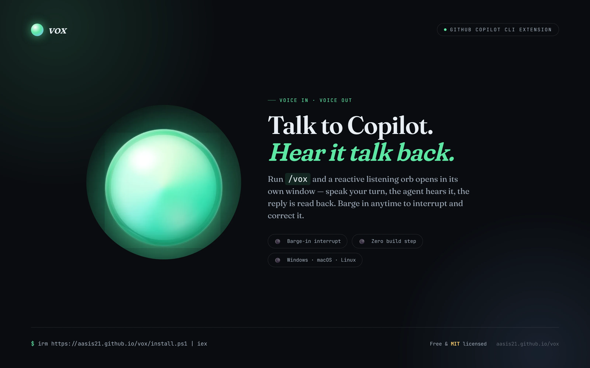

<div align="center">

# Vox

**A hands-free voice panel for any GitHub Copilot CLI session — talk to the agent out loud and hear it reply.**

[](https://aasis21.github.io/vox/)
[](LICENSE)


<br/>



</div>

Vox is a Copilot CLI extension. Run `/vox` and a reactive listening orb opens in
its own window: speak your turn, the active session hears it, and the reply is
read back to you. Voice in, voice out — no editor, no tab-juggling, just talk.

It works in the **GitHub Copilot app**, too — the same panel renders right inside
the app. Add Vox from the app's panel (or ask Copilot to open it); slash commands
like `/vox` stay CLI-only.

**→ See it in action at [aasis21.github.io/vox](https://aasis21.github.io/vox/)**

> Sibling project to [`aasis21/engram`](https://aasis21.github.io/engram/) and
> [`aasis21/Anya`](https://aasis21.github.io/Anya/).

---

## Features

- **Voice in / voice out** — your microphone streams straight into the active
  Copilot session, and the agent's reply is synthesized and read aloud.
- **A reactive orb** — one living orb tells you everything: periwinkle at rest,
  green while it hears you, amber while it thinks, blue while it speaks. It pulses
  with your mic level so you always know you're being heard.
- **Hands-free flow** — if mic permission is already granted, Vox opens straight
  into listening. Speak your turn and it sends automatically after a short pause,
  or tap the orb / press `Space` to send now.
- **Interrupt to talk** — tap the orb, press `Esc`, or hit Interrupt while the
  agent is speaking to cut it off and drop straight back into listening — no
  re-clicking the mic.
- **Live captions** — your speech streams in as interim text and commits as you go.
- **Speaks your typed replies too** — type directly into the Copilot CLI (not just
  voice) and Vox reads the assistant's reply aloud in the panel.
- **Browser Speech or Kokoro** — choose the built-in browser voice for instant,
  low-resource speech or lazily load the official Kokoro 82M model for higher
  quality local inference. Browser Speech remains the automatic fallback.
- **Voice, rate, and pitch controls** — Vox persists the selected engine, every
  voice supported by the official Kokoro JavaScript runtime, speech rate, and an
  approximate semitone pitch shift.
- **Transcript panel** — open the 📜 panel to read the full back-and-forth; close
  or clear it anytime.
- **Session routing + auto-switch** — the centered dropdown shows each live session;
  many can be live at once, and running `/vox` from another session automatically
  switches the open window to it.
- **Standalone app window** — opens as its own chrome-less desktop-style window
  (via Chrome/Edge app mode), not a browser tab, so the Web Speech APIs just work.
- **Cross-platform** — pure JavaScript, no build. One-line install on Windows,
  macOS, and Linux.

---

## Screenshots

| Listening | Speaking | Transcript |
|:---:|:---:|:---:|
|  |  |  |
| Green orb, pulsing with your mic. | Blue orb reading the reply — press `Esc` to barge in. | The full conversation, live, in a slide-in panel. |

---

## Quick start

Requires the **GitHub Copilot CLI** — the
[`copilot`](https://www.npmjs.com/package/@github/copilot) command
(`npm install -g @github/copilot`) — plus **Node.js** and **git** on PATH. Run from any shell:

**Windows (PowerShell):**

```powershell
irm https://raw.githubusercontent.com/aasis21/vox/main/install.ps1 | iex
```

**macOS / Linux (bash):**

```bash
curl -fsSL https://raw.githubusercontent.com/aasis21/vox/main/install.sh | bash
```

That will:
1. Clone the repo to `~/vox` (or update it if already there).
2. Copy the extension into `~/.copilot/extensions/vox`, where Copilot CLI auto-discovers it.

Then start a Copilot session and run `/vox`. Tap the orb or press `Space`, speak
your turn, and pause to send — the reply is read back to you.

## Commands

| Command | What it does |
|---------|--------------|
| `/vox` | Start Vox voice mode and make this session the active voice target. Opens the UI as its own desktop-style window via Chrome/Edge app mode (falls back to `http://localhost:4321`). Tap the orb. |
| `/vox-stop` | Stop Vox for this session and release its voice server. |
| `/vox-who` | List live Vox sessions and show which one is active. |

> **In the Copilot app**, open Vox from the app's canvas panel (or ask Copilot to
> open it) — slash commands aren't available there, but the panel works the same.

## Manual install / dev

From a local clone:

```powershell
.\setup.ps1            # Windows: copy into ~/.copilot/extensions/vox
```

```bash
./setup.sh             # macOS/Linux: copy into ~/.copilot/extensions/vox
```

No package install or build step is required for Browser Speech or Kokoro.
Kokoro is downloaded only if you select it in **Speech settings**.

## Speech engines and controls

Open the gear button in the Vox toolbar to choose an engine and adjust speech.
Settings are shared across Vox sessions in
`~/.copilot/vox-preferences.json` (under the existing Copilot home, never
OneDrive).

### Browser Speech

Browser Speech is the default and uses the browser's
`SpeechSynthesisUtterance`. Vox applies the selected `rate` and `pitch`
directly. It starts immediately, uses the browser's system voice, and remains
the fallback whenever Kokoro is loading or cannot synthesize a sentence.

### Kokoro

Vox pins the official Apache-2.0
[`kokoro-js` 1.2.1](https://github.com/hexgrad/kokoro/tree/main/kokoro.js)
runtime and runs the
[`onnx-community/Kokoro-82M-v1.0-ONNX`](https://huggingface.co/onnx-community/Kokoro-82M-v1.0-ONNX)
model locally in the browser. Inference defaults to deterministic **WASM q8**;
WebGPU is not enabled because browser/GPU driver combinations can corrupt audio.

The first Kokoro selection downloads the q8 model (about **88 MiB**), tokenizer,
runtime/WASM files, and the selected voice data (about **510 KiB per voice**).
The shared Vox front process stores those files in
`~/.copilot/vox-kokoro-cache` for later sessions, independent of the browser
profile or Copilot app canvas cache. Vox does not bundle model weights or voice
binaries, and deleting this directory causes a download on the next use.

The official JavaScript runtime currently supports this complete 28-voice
English catalog. Vox reads `tts.voices` after model load so the runtime remains
authoritative:

| Group | Voices |
|-------|--------|
| American English — Female | Heart (`af_heart`, default), Alloy (`af_alloy`), Aoede (`af_aoede`), Bella (`af_bella`), Jessica (`af_jessica`), Kore (`af_kore`), Nicole (`af_nicole`), Nova (`af_nova`), River (`af_river`), Sarah (`af_sarah`), Sky (`af_sky`) |
| American English — Male | Adam (`am_adam`), Echo (`am_echo`), Eric (`am_eric`), Fenrir (`am_fenrir`), Liam (`am_liam`), Michael (`am_michael`), Onyx (`am_onyx`), Puck (`am_puck`), Santa (`am_santa`) |
| British English — Female | Alice (`bf_alice`), Emma (`bf_emma`), Isabella (`bf_isabella`), Lily (`bf_lily`) |
| British English — Male | Daniel (`bm_daniel`), Fable (`bm_fable`), George (`bm_george`), Lewis (`bm_lewis`) |

Kokoro has no native pitch control. Vox creates each generated buffer at its
actual **24 kHz** sample rate inside a device-native `AudioContext`, allowing
Web Audio to resample safely. It applies
`pitchRatio = 2^(semitones/12)` during playback and generates at
`rate / pitchRatio`, which keeps the requested overall speech rate
approximately stable while shifting pitch. This is a resampling-based,
approximate pitch effect rather than formant-preserving DSP.

Kokoro works best on a current Chromium browser with WebAssembly, several
hundred MiB of available memory, and enough local cache space for the model.
The initial model load can take from seconds to minutes depending on hardware
and network speed; Vox speaks with Browser Speech during that time.

### Chatterbox Nano (optional, Windows CPU)

Chatterbox Nano provides local CPU voice cloning with a reference WAV that you
are authorized to use. Its Python and model dependencies are large, so they are
never installed automatically when Vox loads. Python 3.11 is recommended.

From a PowerShell prompt in the Vox checkout:

```powershell
.\setup.ps1 `
  -InstallChatterbox `
  -ReferenceAudio "C:\path\to\your-authorized-reference.wav"
```

This copies the reference to
`~/.copilot/vox-chatterbox/voices/authorized-reference.wav`, creates a virtual
environment under `~/.copilot/vox-chatterbox/.venv`, installs
the `chatterbox-tts==0.1.7` dependency graph only from Microsoft's approved
internal Python proxy, then installs the Nano-capable package source from a
pinned commit in Resemble AI's official GitHub repository. It writes validated
local settings to
`~/.copilot/vox-chatterbox/config.json`. Model weights and generated data use
`~/.copilot/vox-chatterbox/cache`, and pip's download cache stays under
`~/.copilot/vox-chatterbox/pip-cache`. Vox never commits or uploads the
reference, local JSON, environment, generated audio, or weights.

Every user must supply a local reference they are authorized to clone. A
personal reference must never be redistributed or made a project/default
asset.

Vox starts one dependency-light Python sidecar on an ephemeral `127.0.0.1`
port. It loads
`ChatterboxTurboTTS.from_pretrained(device="cpu", nano=True)` once and prepares
the reference conditioning once, then reuses the model across canvas reloads
while the shared Vox front process remains alive. The settings panel shows
starting/ready/error state, the validated local reference path, and the latest
synthesis latency. The first start can take longer while Hugging Face downloads
the model into the local cache; subsequent starts reuse those files.

Preview and normal playback honor the selected rate through pitch-preserving
browser playback. Chatterbox Nano has no pitch control, so pitch is labeled
unsupported and disabled for this engine. If startup or synthesis fails, Vox
falls back to Kokoro and then Browser Speech.

Mute and barge-in stop browser playback immediately and mark any in-flight
sidecar response for discard. An already-running Torch generation is not
forcibly terminated because doing so would unload the model; ordered playback
continues after that generation finishes. The sidecar is explicitly stopped
when the shared Vox front process shuts down.

Chatterbox-generated audio includes Resemble AI's imperceptible PerTh
watermark. Vox does not vendor model weights. See
[`THIRD-PARTY-NOTICES.md`](THIRD-PARTY-NOTICES.md) for software, model, and
reference-use notices.

`setup.sh` deploys the sidecar source so the extension layout is complete, but
automatic Chatterbox dependency setup is currently supported only by
`setup.ps1` on Windows.

## Uninstall

```powershell
.\uninstall.ps1        # Windows
```

```bash
./uninstall.sh         # macOS/Linux
```

## How it works

A `/vox` command spins up a small local server on port `4321` and registers the
session in `registry.json`. The browser canvas streams microphone audio in and plays synthesized replies
through Browser Speech or Kokoro, routing spoken turns to the active session. A
persistent `/listen` channel also streams replies from **typed** CLI turns to the
panel so they're spoken too.

Many sessions can be live at once; `/vox-who` shows which one is active. Running
`/vox` from another session sets a monotonic focus token, so the already-open
window switches to whichever session asked for it last — no duplicate windows.

`/vox` opens the panel as a standalone, chrome-less window using an installed
Chromium browser in app mode (Chrome preferred, then Edge) — this keeps the
browser's Web Speech APIs working, which Electron and native webviews don't. The
window uses a dedicated profile (`~/.copilot/vox-app-profile`) so it has its own
identity and remembers the mic permission. Override the browser with
`VOX_BROWSER=chrome|edge|brave|chromium` or a full path to an executable.

## License

Licensed under the [MIT License](LICENSE).

Kokoro-related third-party attribution is in
[THIRD-PARTY-NOTICES.md](THIRD-PARTY-NOTICES.md), with the Apache-2.0 license
text under [`LICENSES/`](LICENSES/Apache-2.0.txt).
